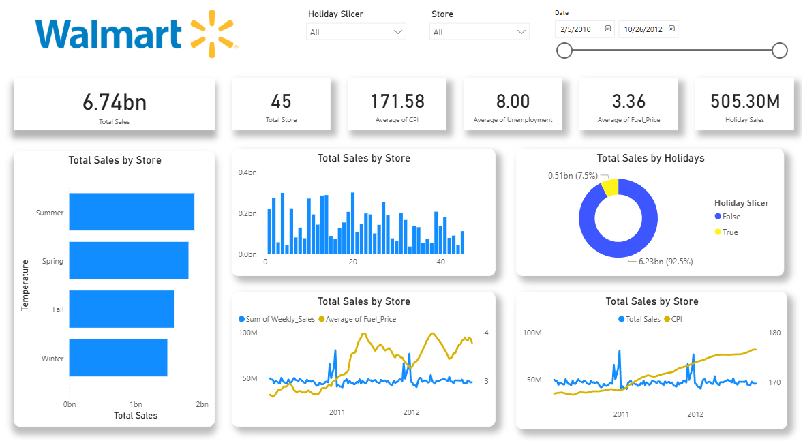

# 🛒 Walmart Sales Analysis | Power BI Dashboard

## 📌 Project Overview
This project focuses on analyzing supermarket sales data sourced from **kaggle walmart sales dataset** and transforming it into an insighful **interactive PowerBI dashboard.** The objective is to answer big business questions and  to derive an actionable business insights to further increase business income.

## 📂 Dataset
- Source: **Kaggle Coffee Sales dataset**
- Format: **Microsoft Excel**

## 🎯 Key Objectives Questions
### **1. Which Walmart stores contribute the most to total sales, and where are the underperforming stores?**
- **Insight**: 
- **Why it matters**:
---
### **2. Which Walmart stores contribute the most to total sales, and where are the underperforming stores?**
- **Insight**: 
- **Why it matters**:

## 🛠 Tools & Technologies

## 📷 Dashboard Preview

- 📷 Dashboard preview images included in this repository
- 📁 Power BI file available for review

# Why This Project Matters

## Reach out to me!

